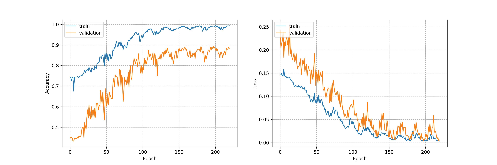

# info
A implements of CNN Cough Sound Classification

CNN: MobileNetV2

Dataset: [CoughVID](https://paperswithcode.com/dataset/coughvid)

# setup
```text
Data: coughvid, feature:Mel-Spectrogram

Pretrained Model: None; 
Model: MobileNetV2, Loss: FocalLoss

LR: 0.0002, schedule: torch.optim.lr_scheduler.CosineAnnealingLRepoch_num: 220, batch_size: 128
```

# run
```commandline
python trainer.py
```

# train
```text
trainer.train()
```

# test
```
trainer.test(resume_model_path="../runs/dsptcls/covid19randmnv2202405151239/ckpt_epoch149.pt")
```

# Result



# Reference
1. MobileNetV2
2. CoughVID
3. [Data Cleaning from Kaggle](https://www.kaggle.com/code/nasrulhakim86/covid-19-screening-from-audio-part-2/notebook)
4. [Data Cleaning from wavencoder](https://github.com/shangeth/wavencoder)

end.